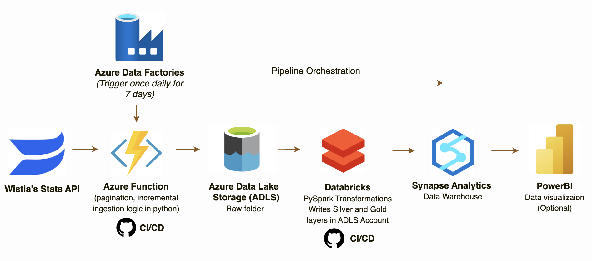

# Wistia Video Analytics — End-to-End Azure Data Pipeline

**[Watch Video Project Walkthrough](https://youtu.be/njy4wowDJUc)**


An end-to-end data engineering pipeline that ingests video engagement analytics
from the Wistia Stats API, transforms the data through a medallion architecture,
and serves it via Azure Synapse Analytics.

Built entirely on Azure using Python, PySpark, and GitHub Actions CI/CD.

---
## Optimized Architecture (after SME Review)



> Following SME review, the architecture was simplified to reduce complexity and align with industry best practices for Databricks-centric pipelines.
> 
> Changes Made:
> * The original implementation used Azure Functions for API ingestion and Azure Data Factory for orchestration. While functional, these additional services introduced unnecessary complexity — more services mean more potential failure points, more credentials to manage, and more infrastructure to maintain.
> * The revised architecture consolidates everything into Databricks.
> * Azure Functions removed → move ingestion logic into a dedicated Databricks Python notebook, keeping all pipeline code in one place
> * Azure Data Factory removed → replaced by Databricks Workflow Scheduler, which provides the same scheduling, monitoring, and retry capabilities natively within Databricks
> * Parquet replaced with Delta tables → Delta is a proper table format with ACID transactions, schema enforcement, and time travel. Parquet is a file format, not a table — Delta is the industry standard for medallion architectures on Databricks
> * One notebook per table → originally all transformations ran in a single notebook. Splitting into one notebook per table (dim_media, dim_visitor, fact_media_engagement_daily, fact_visitor_events) means a failure in one transformation doesn't block the others
>
> Note: These changes were not implemented due to time constraints 

## Architecture (project docs currently reflect this architecture) 


---

## Tech Stack

| Layer | Technology |
|---|---|
| Ingestion | Azure Functions (Python) |
| Orchestration | Azure Data Factory |
| Storage | Azure Data Lake Storage Gen2 |
| Transformation | Databricks (PySpark) |
| Serving | Azure Synapse Analytics (Serverless SQL) |
| Secrets | Azure Key Vault |
| CI/CD | GitHub Actions |
| Version Control | GitHub |


→ Full Component Breakdown & Design Rationale: [`docs/architecture.md`](docs/architecture.md)

---

## Data Model

| Table | Description |
|---|---|
| `dim_media` | One row per video — title, channel, duration, embed URL |
| `dim_visitor` | One row per unique visitor — location, browser, device |
| `fact_media_engagement_daily` | Daily aggregates per video — plays, loads, watch time, play rate |
| `fact_visitor_events` | One row per play event — visitor, timestamp, % watched |

→ Full data model with source mappings: [`docs/data-model.md`](docs/data-model.md)

---

## Quick Start

→ Full documentation of my project's process, issues encountered, decisions, etc.: [`docs/project-log.md`](docs/project-log.md)

### Prerequisites
- Azure subscription
- Python 3.11+
- Azure Functions Core Tools v4
- Databricks CLI

### 1. Clone the repo
```bash
git clone https://github.com/lujaynmegally1/Wistia-video.git
cd Wistia-video
```

### 2. Install dependencies
```bash
pip install -r requirements.txt
```

### 3. Configure Key Vault
Add to Azure Key Vault `wistia-keyvault-lm`:
- `wistia-api-token` → your Wistia API token

### 4. Deploy Azure Function
```bash
func azure functionapp publish wistia-ingestion-lm2 --python
```

### 5. Trigger pipeline manually
```
GET /api/test
```

### 6. Run Databricks transformation
Databricks → Workspace → Wistia → run `wistia-video-gold`

### 7. Set up Synapse views
Connect to Synapse serverless endpoint and run the setup script:
- Server: `wistia-synapse-lm-ondemand.sql.azuresynapse.net`
- Script: [`docs/synapse-setup.sql`](docs/synapse-setup.sql)

Note: Run `CREATE DATABASE` connected to `master`, then switch 
to `wistia_gold` for all view creation statements.

---

## CI/CD

| Component | Method |
|---|---|
| Azure Functions | `func azure functionapp publish` via terminal. (Commit to GituHub for version control) |
| Databricks Notebooks | GitHub Actions → Databricks CLI on push to `main` |

Required GitHub Secrets:
- `DATABRICKS_HOST`
- `DATABRICKS_TOKEN`

---

## Docs

- [Architecture & Design Rationale](docs/architecture.md)
- [Data Model](docs/data-model.md)
- [Project Log](docs/project-log.md) 
